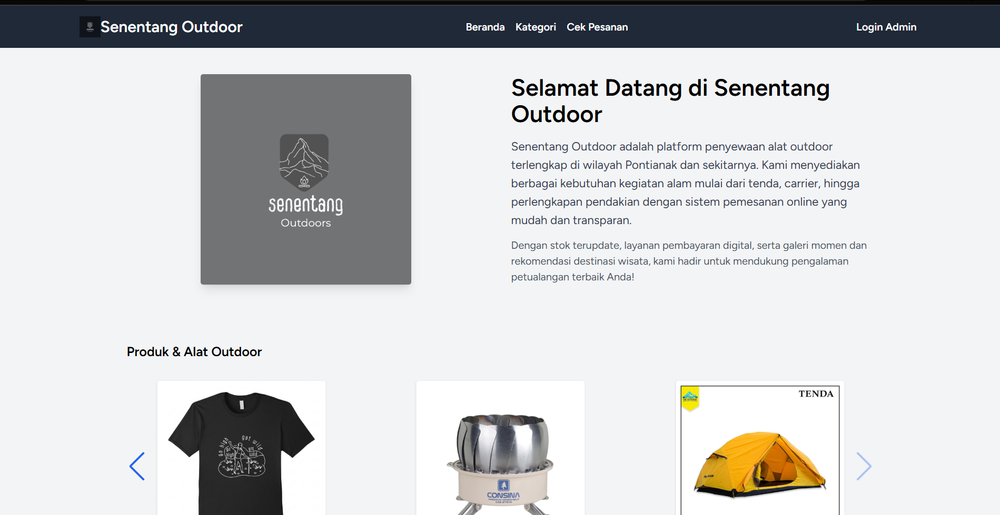
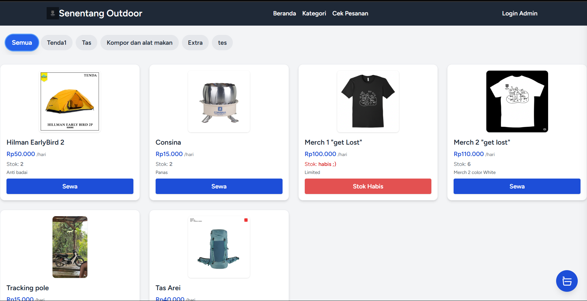
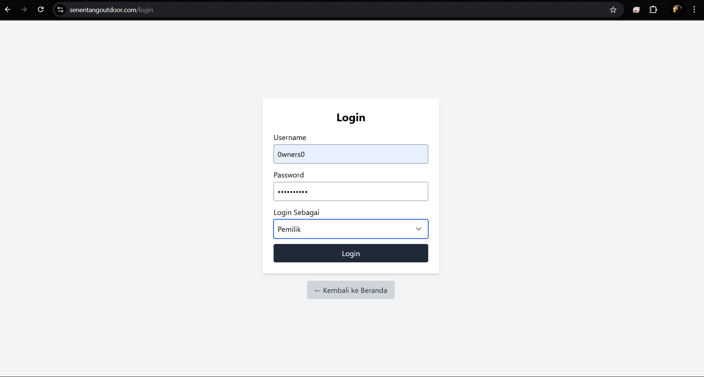
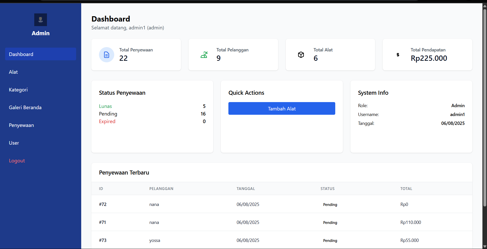
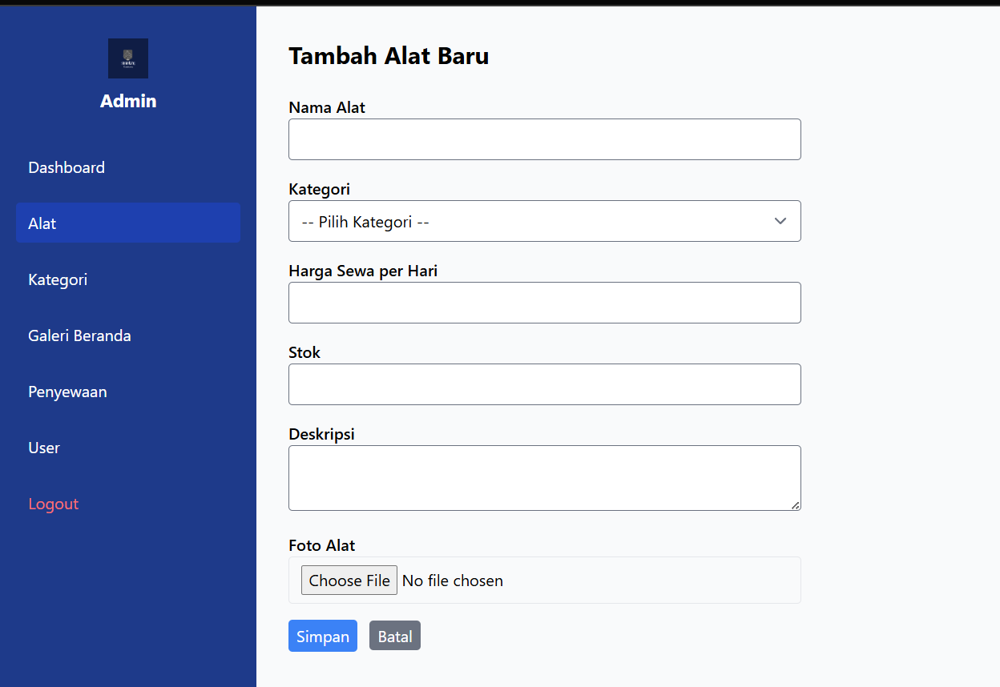
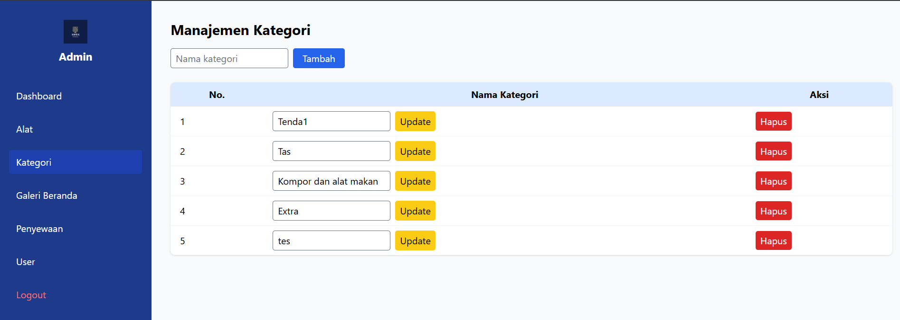
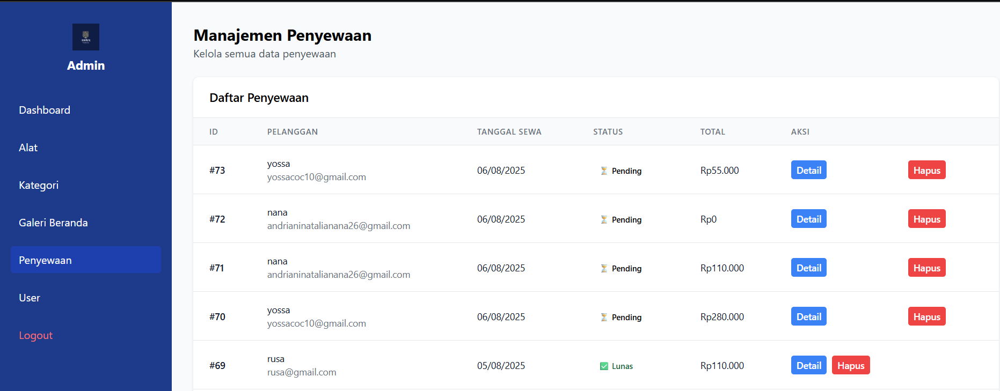

## 1. Judul & Deskripsi

Aplikasi Penyewaan Alat Outdoor Berbasis Web di Senentang Outdoor

Aplikasi web yang digunakan untuk mengelola katalog alat outdoor, kategori, galeri pendakian, rekomendasi wisata, proses penyewaan dengan keranjang, hingga checkout dan pencatatan transaksi penyewaan pelanggan.

---

## 2. Deskripsi Ringkas Fungsi dan Tujuan

Aplikasi ini membantu pemilik dan pengelola Senentang Outdoor dalam:

- Menampilkan informasi produk/alat outdoor secara online kepada pelanggan
- Mengelola data alat, kategori, dan stok secara terpusat
- Menyediakan keranjang sewa yang interaktif untuk pelanggan
- Mencatat transaksi penyewaan dan mengurangi stok secara otomatis
- Menyajikan galeri pendakian dan rekomendasi tempat wisata sebagai media promosi

### Fitur Utama

- **Beranda**
  - Hero section dengan logo dan deskripsi singkat Senentang Outdoor
  - Slider produk/alat outdoor terbaru
  - Slider galeri pendakian
  - Slider rekomendasi tempat wisata beserta link media sosial
  - Footer dengan alamat lengkap dan link ke Instagram & WhatsApp

- **Katalog Alat & Kategori**
  - Daftar alat dengan informasi:
    - Nama alat
    - Harga sewa per hari
    - Stok terkini
    - Deskripsi singkat
  - Filter berdasarkan kategori (misalnya tenda, carrier, perlengkapan pendakian, dll.)
  - Indikator stok: tersedia / habis

- **Keranjang Sewa Interaktif**
  - Sidebar keranjang di halaman katalog yang dapat dibuka/tutup
  - Tambah alat ke keranjang melalui tombol “Sewa”
  - Atur jumlah unit alat dengan validasi terhadap stok tersedia
  - Atur durasi sewa (hari) dan hitung total otomatis
  - Grand total dihitung berdasarkan: jumlah × harga sewa per hari × durasi
  - Penyimpanan sementara keranjang di browser (`localStorage`), kemudian dipindah ke session saat lanjut ke checkout

- **Checkout & Transaksi**
  - Form checkout berisi:
    - Nama
    - Email
    - Alamat
    - No. telepon
    - Persetujuan syarat & ketentuan
  - Validasi form di sisi server
  - Perhitungan tanggal sewa dan tanggal kembali berdasarkan durasi
  - Penyimpanan transaksi ke database:
    - Data pelanggan
    - Data penyewaan (header)
    - Detail penyewaan (per item alat)
  - Pengurangan stok alat otomatis setelah transaksi berhasil
  - Pengosongan data keranjang di session setelah checkout
  - Halaman nota konfirmasi penyewaan (`/nota/{id}`)
  - Fitur pembatalan checkout untuk mengosongkan keranjang kembali

- **Panel Admin & Pemilik**
  - **Autentikasi Kustom**
    - Login menggunakan username & password
    - Pilihan role: `admin` atau `pemilik`
    - Penyimpanan role, id, dan username di session
  - **Manajemen Alat (CRUD)**
    - Tambah, ubah, hapus data alat
    - Penentuan kategori alat
    - Pengaturan harga sewa per hari, stok, deskripsi
    - Upload foto alat (disimpan di `storage/app/public/alats`)
  - **Manajemen Kategori (CRUD)**
    - Tambah, ubah, hapus kategori alat
    - Digunakan untuk filter katalog di sisi pelanggan
  - **Manajemen Galeri Pendakian**
    - Tambah, ubah, hapus data foto pendakian
    - Upload gambar ke `storage/app/public/galeri_pendakian`
    - Deskripsi pendakian (opsional)
  - **Manajemen Rekomendasi Wisata**
    - Tambah, ubah, hapus rekomendasi wisata
    - Upload gambar ke `storage/app/public/rekomendasi_wisata`
    - Link media sosial dan deskripsi tempat
  - **Galeri Beranda Admin**
    - Halaman ringkasan untuk melihat seluruh data galeri pendakian & rekomendasi wisata yang tampil di beranda

---

## 3. Teknologi yang Digunakan

- Framework: Laravel 12 (PHP ^8.2)
- Frontend: Blade + Tailwind CSS, Alpine.js, Swiper.js, Vite
- Database: SQLite (default) atau MySQL/MariaDB (dapat disesuaikan)
- Tooling: Composer, Node.js & npm

---

## 4. Instalasi & Konfigurasi

1) **Siapkan lingkungan**
   - XAMPP aktif (Apache & MySQL) atau gunakan built-in server Laravel (`php artisan serve`)
   - PHP 8.2+, Composer, Node.js & npm sudah terpasang

2) **Ambil kode sumber**
   - Letakkan proyek di, misalnya:  
     `C:\xampp\htdocs\senentang_outdoor`

3) **Pasang dependensi**
   - Jalankan:
     - `composer install`
     - `npm install`

4) **Konfigurasi `.env`**
   - Salin contoh:
     - `copy .env.example .env`
   - Generate key:
     - `php artisan key:generate`
   - Contoh konfigurasi database dengan SQLite (default):
     - `DB_CONNECTION=sqlite`
     - Buat file database:
       - `database/database.sqlite` (bisa dibuat manual atau via command)
   - Contoh konfigurasi jika menggunakan MySQL:
     - `DB_CONNECTION=mysql`
     - `DB_HOST=127.0.0.1`
     - `DB_PORT=3306`
     - `DB_DATABASE=senentang_outdoor`
     - `DB_USERNAME=root`
     - `DB_PASSWORD=` (kosong jika default XAMPP)
   - Buat database dengan nama yang sama di phpMyAdmin bila memakai MySQL

5) **Migrasi database**
   - Jalankan:
     - `php artisan migrate`

6) **Storage link (untuk akses gambar)**
   - Jalankan:
     - `php artisan storage:link`

7) **Menjalankan aplikasi**
   - Dev server:
     - `php artisan serve` lalu akses <http://127.0.0.1:8000>
   - Atau via XAMPP:
     - Arahkan virtual host/URL ke folder `public/`  
       Contoh akses: `http://localhost/senentang_outdoor/public`

8) **Aset front-end**
   - Mode pengembangan: `npm run dev`
   - Build produksi: `npm run build`

Catatan: Jika perubahan tidak muncul, coba `php artisan config:clear` dan `php artisan route:clear`.

---

## 5. Tata Cara Penggunaan Aplikasi

1) **Akses Beranda**
   - Buka URL utama aplikasi.
   - Lihat informasi singkat tentang Senentang Outdoor, slider produk, galeri pendakian, dan rekomendasi wisata.

2) **Melihat Katalog Alat**
   - Navigasi ke menu **Kategori**.
   - Pilih kategori tertentu atau tampilkan semua alat.
   - Cek detail: nama alat, harga sewa per hari, stok, dan deskripsi.

3) **Menambah Alat ke Keranjang**
   - Pada kartu alat, klik tombol **Sewa**.
   - Tentukan jumlah unit yang ingin disewa (dibatasi stok).
   - Klik **Oke** untuk menambahkan ke keranjang.
   - Keranjang dapat dibuka dari tombol melayang di kanan bawah.

4) **Mengatur Durasi dan Total Sewa**
   - Buka sidebar keranjang.
   - Atur **durasi sewa (hari)**.
   - Total per item dan grand total akan otomatis diperbarui.
   - Jika ingin menghapus item, klik tombol hapus (`×`) pada baris item.

5) **Melanjutkan ke Checkout**
   - Di sidebar keranjang, klik tombol **Lanjutkan**.
   - Sistem akan menyimpan isi keranjang & durasi ke session dan mengarahkan ke halaman checkout.

6) **Mengisi Formulir Checkout**
   - Isi data:
     - Nama
     - Email
     - Alamat
     - No. telepon
   - Centang persetujuan syarat & ketentuan (agreement).
   - Klik tombol untuk menyelesaikan checkout.
   - Jika valid, transaksi akan tersimpan dan stok alat berkurang sesuai jumlah disewa.

7) **Melihat Nota Penyewaan**
   - Setelah checkout berhasil, pengguna diarahkan ke halaman nota (`/nota/{id}`).
   - Nota berisi ringkasan penyewaan (pelanggan, daftar alat, durasi, total biaya).

8) **Membatalkan Checkout (Opsional)**
   - Jika ingin membatalkan, tersedia route untuk cancel yang akan mengosongkan keranjang di session dan mengembalikan user ke halaman katalog.

9) **Login Admin/Pemilik**
   - Akses menu **Login Admin** di navbar.
   - Masukkan username, password, dan pilih role (`admin`/`pemilik`).
   - Setelah login sukses, akan diarahkan ke halaman manajemen (misalnya data alat).

10) **Mengelola Data Alat & Konten**
    - Dari panel admin:
      - Tambah/ubah/hapus alat dan kategori.
      - Tambah/ubah/hapus galeri pendakian.
      - Tambah/ubah/hapus rekomendasi wisata.
    - Perubahan akan otomatis tercermin di halaman beranda dan katalog pelanggan.

---

## 6. Screenshots

### Beranda

### Katalog Alat

### Form Login Admin/Pemilik

  

### Panel Admin

  

---

## 7. Lisensi

  

**Private License**  

Project ini dibuat untuk kebutuhan internal Senentang Outdoor dan/atau keperluan akademik terkait.  

Dilarang keras untuk:

- Menyalin  
- Mendistribusikan  
- Memodifikasi  
- Menggunakan ulang project ini  

tanpa izin tertulis dari pemilik/pengembang.

---

## Authors

- **Nama : Kanisius Yossa Pratma Junior** –
- **NIM : 3202216035** -